# blog-for-techs
A CMS-style blog site similar to a Wordpress site, where developers can publish their blog posts, comment on other developers' posts, update and/or delete posts, and create a user account to store your information. 

This application was built completely from scratch and deployed to Heroku. This Tech Blog follows the **MVC Paradigm** (Model-View-Controller) in its architectural structure, using **Handlebars.js** as the templating language, **Sequelize** as the ORM, and the **express-session** npm package for authentication.

## Tech Blog
Many software developers love their craft, and spend hours not just writing code, but actively engaging with the community, staying up-to-date with latest tools, and trying to learn new things. Writing about technology can just be as important creating it. This means making complex text, ideas, or conclusions presentable and easy-to-understand. Even looking at the coding process itself, developers can make their code more meaningful with better guiding comments. Developers spend plenty of time creating new applications and troubleshooting, and most great developers also attribute at least some time to reading and wrriting about technical concepts, advancements, and new technologies.

## User Story
```md
AS A developer who writes about tech
I WANT a CMS-style blog site
SO THAT I can publish articles, blog posts, and my thoughts and opinions
```

## Table of Contents
* [Description](#description)
* [Installation](#installation)
* [Usage](#usage)
* [Built With](#built-with)
* [Visuals](#visuals)
* [Screens](#screens)

## Description
A convenient, browser-based platform for developers looking to share and gain up-to-date knowledge about technology.

## Installation
This application allows users to easily create, update, and delete blogs and comments after:

- [x] Cloning the GitHub repository locally
- [x] Installing necessary packages
- [x] Running seeds to insert data into the tech_blog_db

1. To clone this project from GitHub to your local computer

> Click the Code drop-down button in this page and Copy URL for that repository:

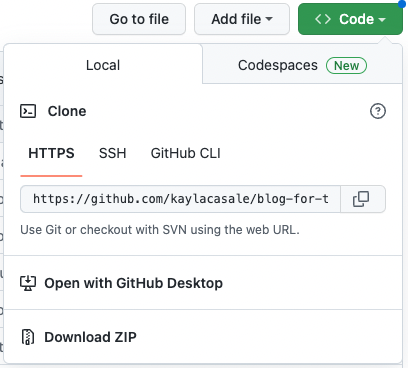

> Enter the following command in your terminal on the level of your project folder (assuming you have Git installed)

    `git clone <URL>`
    > URL = https://github.com/kaylacasale/blog-for-techs.git


2. To install neccessary packages

This application uses Node.js, Sequelize, Handlebars.js, and the expression-session npm package in order to run on your browser (localhost:3001).

> Enter into the command-line

    `npm install`

OR

    `npm i`


3. To insert seeds into the tech blog database using Sequelize models

> Enter into the command-line

    `npm run seed`

OR

    `node run seeds/seed.js`

>> **Personalize your seeds by entering your own blog, user, and comment information into the JSON files located in the `seeds` folder**

## Usage

To start the application, run the following command(s) in the commend-line.

    `npm run start`

OR

    `npm start`

This application lets you do the things:

    - Navigate to the homepage where I could view existing blog posts, view more information about each post including post creator's username, date created, and and comments on the post, the option to log-in if you are a pre-existing user, and the option to sign-up from the log-in page.
    - Sign-up with a username and password (over 8 character in length) and save login credentials to populate your user data 
    - Log-in with a valid username and password to connect to your tech blog database
    - Once logged in, users can navigate to the dashboard to view and access all blog posts published as a user, click on an individual blog post to see associated comments, delete a blog post, and update a blog post you created
        - After pressing the update button available in the dashboard, users will be redirected to a new page where the title and content of their post is pre-populated with existing data, and where they can manipulate and update the blog by entering new information into the text area and pressing SUBMIT
    - Once logged in, users can navigate to homepage and click on any blog post, be directed to specific information about the post, and add as many comments as desired that will remain under that blog post
    - Once logged in, users can logout of their account by pressing the logout link and later return to the login page with valid credentials

## Built With
> HTML
> CSS 
> Javascript

* Node.js
* Sequelize
* MySQL Workbench (database & visuals)
* npm
    * express-sessions
    * express-handlebars
    * dotenv
* Bootstrap 
* Heroku (deployment)
* Adobe XD (visuals)

## Visuals

> ERD (Entity Relationship Diagram)
- Reverse Engineered via MySQL Workbench

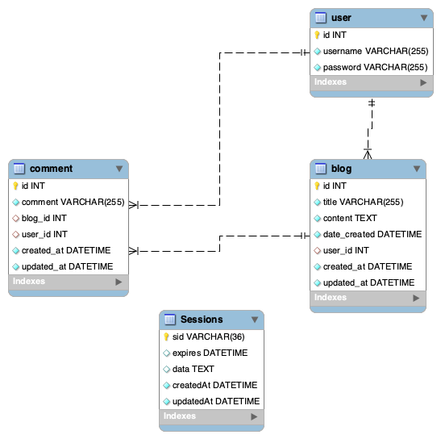

- Showing Indexes

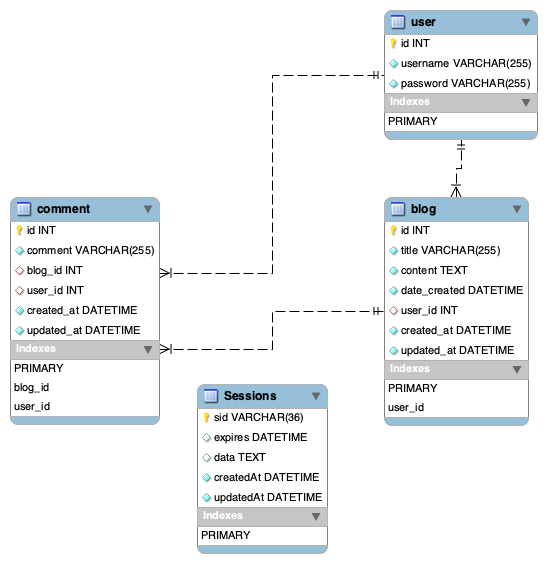

> 3D Visual ERD (created with Adobe XD)
- Shows how seqeulize models get sent in routes to handlebars pages and how relationships through foreign keys allow various of acessing data through linked models
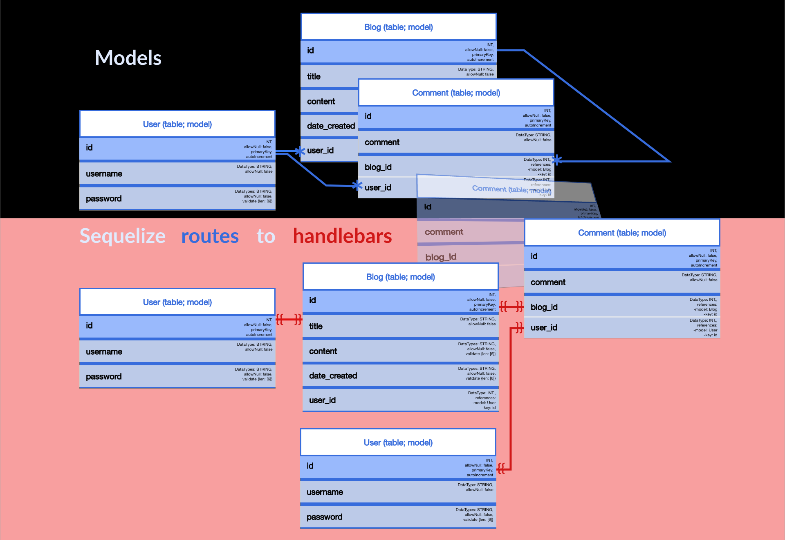

## Screens
> Main Screen
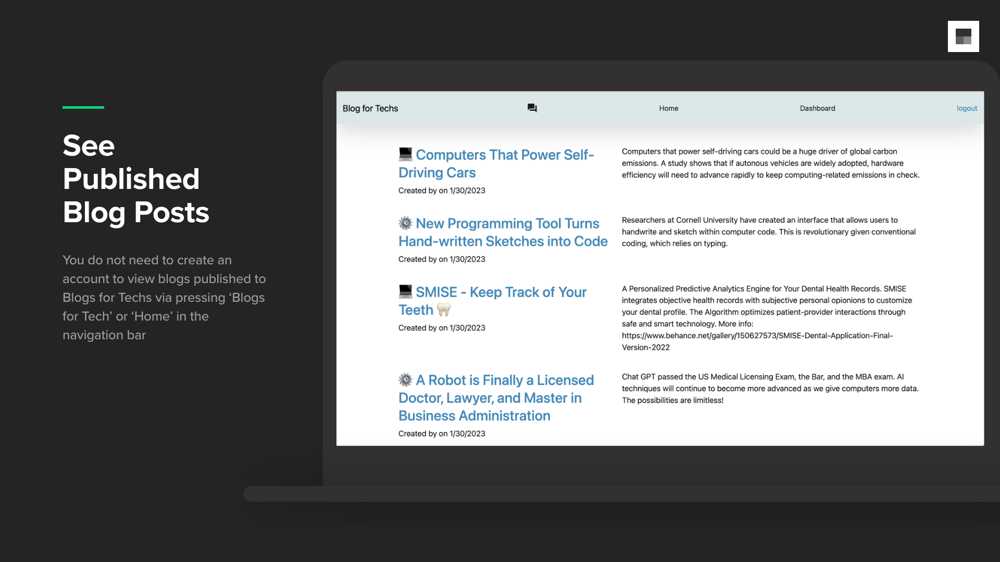

> Signup
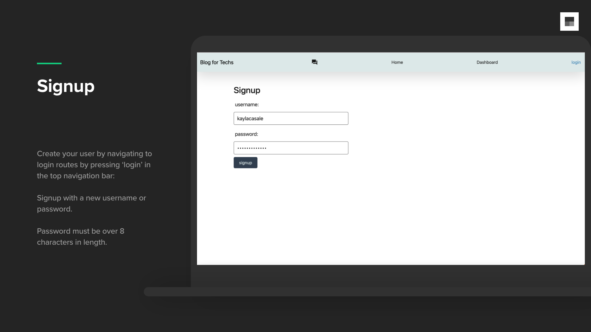

> Login
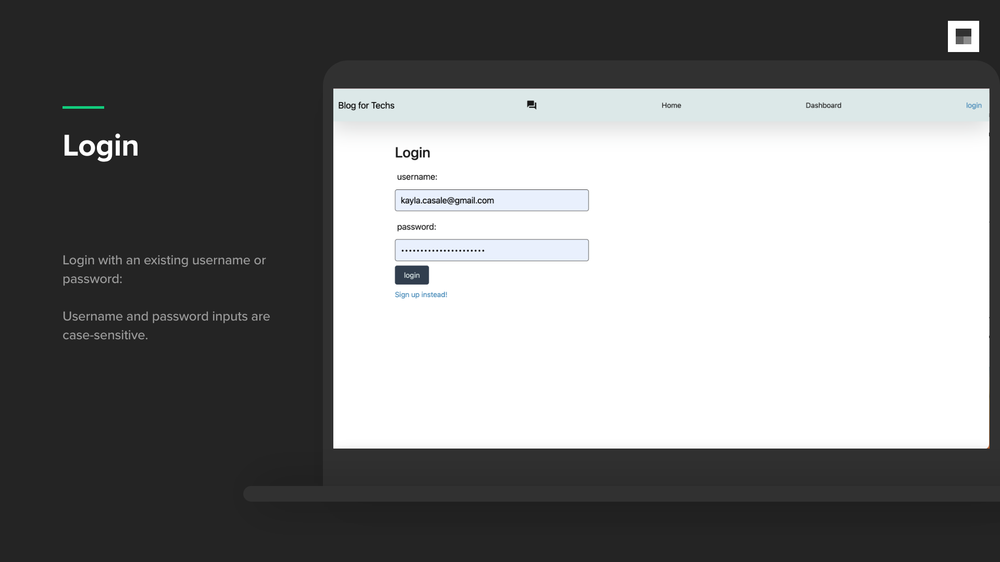

> Dashboard
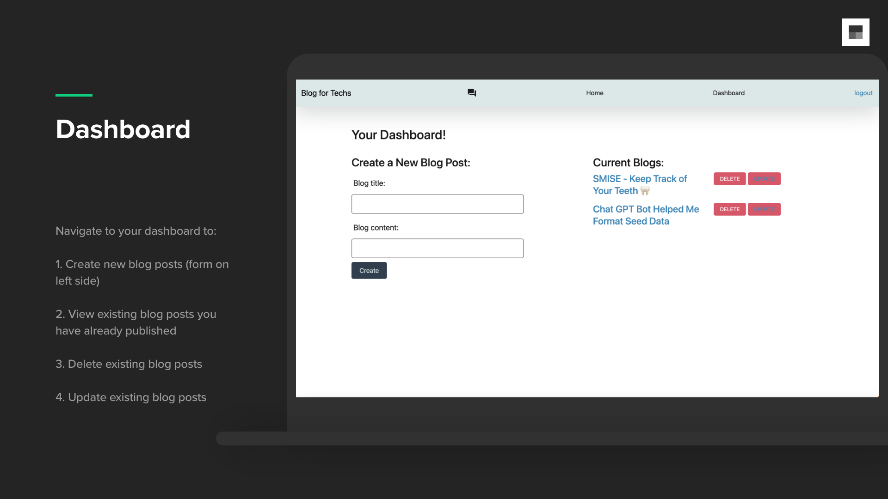

>> 1. Create Blogs
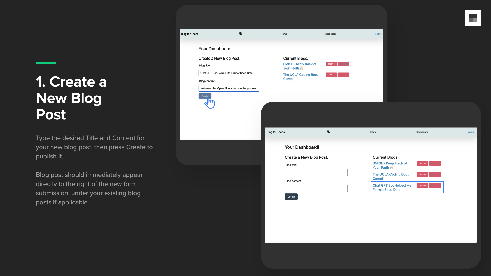

>> 2. View Your Blogs
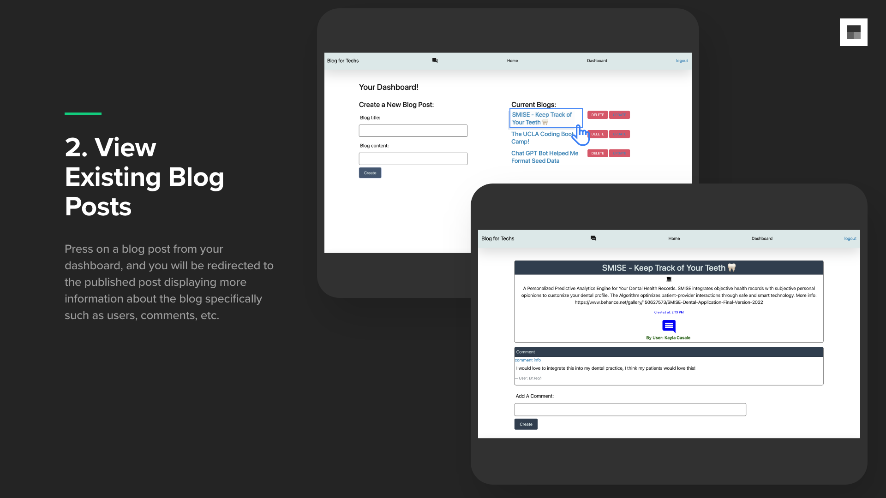

>> 3. Delete Blogs
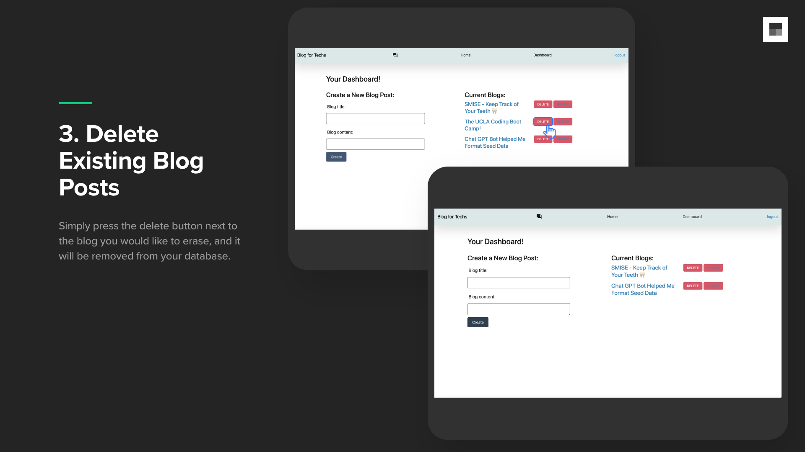

>> 4. Update Blogs
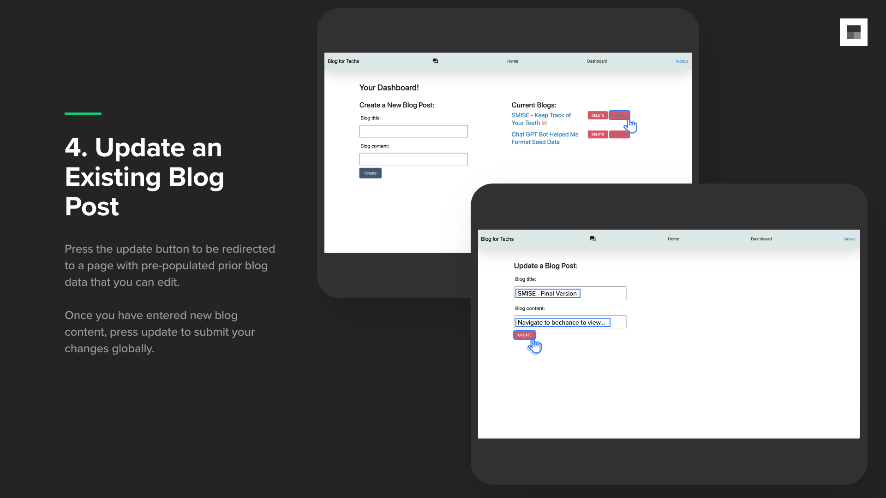

> Homepage After Login
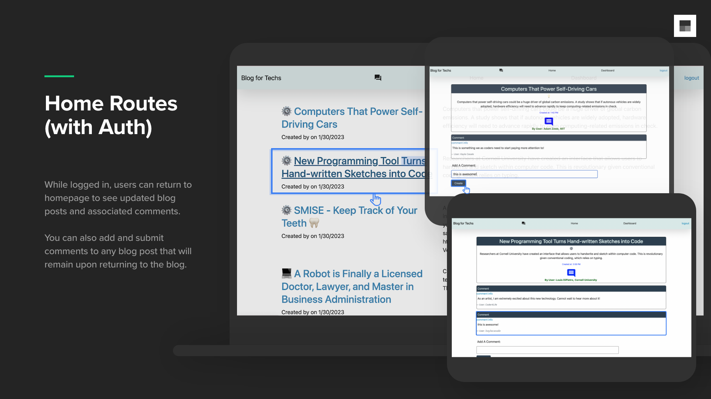